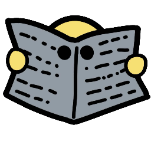
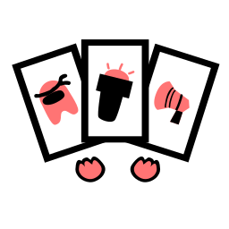
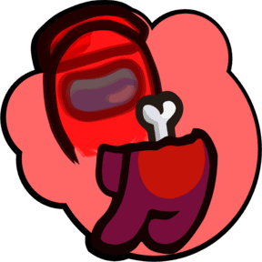
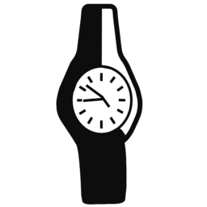
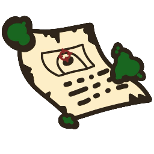
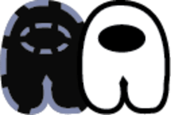

> [!NOTE]
> This mod was created with the help of AI as a tool, all art and assets are and will be made by HUMANS.\
> This repo is an addon of [Town of Us Mira]([https://github.com/AU-Avengers/Town-Of-Us-Reactivated](https://github.com/AU-Avengers/TOU-Mira)) and is currently under development, expect bugs.\
> This mod is ONLY available on PC Among Us.

-----------------------
> Logo goes here
<!-- 

  -->

> [!TIP]
> Join the Jack Of All Mods [Discord]([https://discord.gg/3s9ekkTkU]) if you have any problems or suggestions for the mod!
-----------------------

# Contents

- [**Contents**](#contents)
- [**Releases**](#releases)
- [**License**](#license)
- [**Copyright**](#copyright)

-----------------------

  
  
  
  
  
  
  
  
  
  
  
  
  <!-- 
   -->
  
  
  
  
  
  
  
  
  
  
  
  
  
  
  
  
  
  

-----------------------

# Releases

**Disclaimer: The mod is *not* guaranteed to work on the latest versions of Among Us when the game updates.**

| Among Us          | Mod Version | Download Link                                                           |
|-------------------|-------------|-------------------------------------------------------------------------|
| 17.4.             | 1.0.0      | [Download](https://www.youtube.com/watch?v=E4WlUXrJgy4)  |
-----------------------

# Contributions & Credits

[MiraAPI](https://github.com/All-Of-Us-Mods/MiraAPI) - The primary framework of the mod\
[DivaniNL](https://github.com/DivaniNL) - For some bits of Memento, Workhorse and Revenant code.\
[Mehzz](https://www.youtube.com/watch?v=E4WlUXrJgy4) - For a bit of extra tasks code.\
[Endless Host Roles](https://github.com/Gurge44/EndlessHostRoles) - For the Workaholic role idea.\

<b>Artists</b>./
Atlas./
Xinav./
HarckDOof./
Lightblade./
Phantombee./
Jay./

> [!NOTE]
> The following credits originate from the original TOU/TOUR repositories.

[Reactor](https://github.com/NuclearPowered/Reactor) - Dependency for the mod\
[BepInEx](https://github.com/BepInEx) - For hooking game functions\
[Among-Us-Sheriff-Mod](https://github.com/Woodi-dev/Among-Us-Sheriff-Mod) - For the Sheriff role.\
[Among-Us-Love-Couple-Mod](https://github.com/Woodi-dev/Among-Us-Love-Couple-Mod) - For the inspiration of Lovers role.\
[ExtraRolesAmongUs](https://github.com/NotHunter101/ExtraRolesAmongUs) - For the Engineer & Medic roles.\
[TooManyRolesMods](https://github.com/Hardel-DW/TooManyRolesMods) - For the Investigator & Time Lord roles.\
[TorchMod](https://github.com/tomozbot/TorchMod) - For the inspiration of the Torch modifier.\
[XtraCube](https://github.com/XtraCube) - For the Rainbow color.\
[TheOtherRoles](https://github.com/Eisbison/TheOtherRoles) - For the inspiration of the Vigilante, Sonar (formerly Tracker) and Spy roles, as well as the Bait modifier.\
[5up](https://www.twitch.tv/5uppp) and the Submarine Team - For the inspiration of the Grenadier role.\
[MyDragonBreath](https://github.com/MyDragonBreath) - For Submerged Compatibility, the Trapper and Aurial roles, and the Aftermath modifier\
[ItsTheNumberH](https://github.com/itsTheNumberH/Town-Of-H) - For the code used for Blind, Bait, Poisoner and partially for Sonar, as well as other bug fixes.\
[Ruiner](https://github.com/ruiner189/Town-Of-Us-Redux) - For lovers changed into a modifier and Task Tracking.\
[Term](https://www.twitch.tv/termboii) - For creating Transporter, Medium, Blackmailer, Plaguebearer, Sleuth, Multitasker.\
[BryBry16](https://github.com/Brybry16/BetterPolus) - For the code used for Better Polus.

-----------------------

# License
This software is distributed under the GNU GPLv3 License. BepInEx is distributed under the LGPL-2.1 License.

# Copyright

This mod is not affiliated with Among Us or Innersloth LLC, and the content contained therein is not endorsed or otherwise sponsored by Innersloth LLC. Portions of the materials contained herein are property of Innersloth LLC.

© Innersloth LLC.

